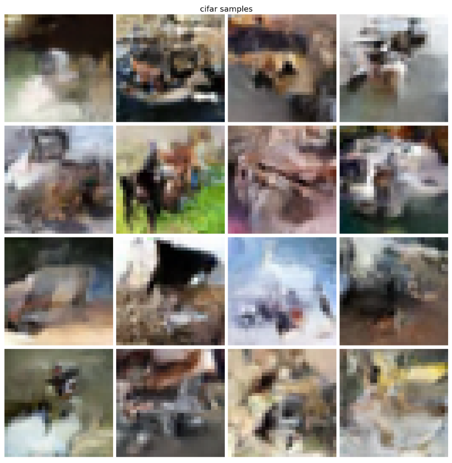

# real-nvp
Implementation of Real-NVP (https://arxiv.org/abs/1605.08803) in Tensorflow.

Started with code from PixelCNN++ by OpenAI (https://github.com/openai/pixel-cnn)

Sample usage:

1. Create directories for downloading dataset and saving checkpoints. 
2. Run train.py. '--nr_gpu', which denotes the number of GPUs to use, should be specified. 

Sample usage: 
$ CUDA_VISIBLE_DEVICES=1,2 python3 train.py --nr_gpu=2 --data_dir=download --save_dir=checkpoints --load_params=0 --save_interval=2

Sample image from the model trained on CIFAR10. The test NLL was 3.51. 

